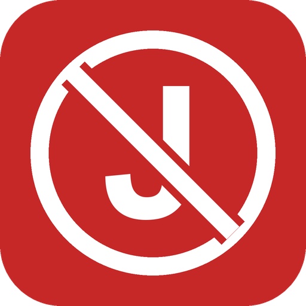
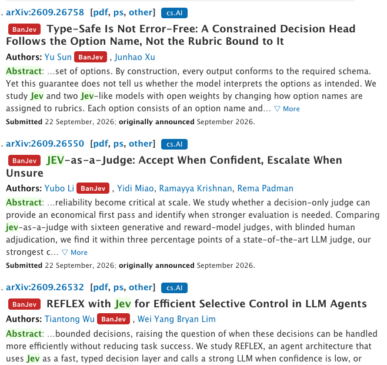

# BanJev

**节约读论文时间，节约读论文的 token。**

[English](README.md) · 中文 · [排行榜页面](https://ironieser.github.io/banjev/)



BanJev 是一个 Chrome 插件（Manifest V3）。它在 **arXiv** 和 **Google Scholar** 上给**蹭热点的论文**及其作者打上 `BanJev` 标记。这样你在挑选要读的论文、或者要喂给大模型的论文时，可以把它们往后排。

## 为什么叫 BanJev？这不是针对 Jev

BanJev **不是**针对 Jev、TypeSafe AI，也不是针对基于 Jev 做东西的人。很多扎实的项目都在用它（见 [awesome-jev](https://github.com/yibie/awesome-jev)）。Jev 只是我们**观察到某种现象的地方**，名字指的是这个现象，而不是这个模型：

1. **2026-09-17**：Jev（TypeSafe AI 的 System One 模型）爆火。
2. **2 到 5 天后**：arXiv 上出现了一批标题里带 “Jev” 的预印本：“X with Jev”、“Jev for Y”、“Jev-as-a-Z”。
3. 认真的研究，包括实验、基线、消融和写作，通常要几周到几个月。一篇研究几天前才发布的模型的论文，很可能是**为了蹭热度而写的**：目标是抢先，而不是回答一个真实的问题。
4. 读者的注意力和 token 预算都有限。一个人在热点周期里的表现，是一个成本很低但有用的信号。如果某位作者赶着发了一篇蹭热点的论文，那么把**他的**论文在阅读队列里往后排，是合理的。

所以，标记只表示一件事：**此人为了蹭 Jev 的热度，赶着往 arXiv 上发了论文。**它不评价 Jev 本身，也不评价任何一篇具体论文的内容。它是一个阅读优先级过滤器。

为什么一作权重最高：一作通常是决定写这篇论文、并且实际做了工作的人；第五作者可能只是挂了个名。所以计分按作者位次加权（见下文）。

这套机制并不绑定 Jev，只需要一个关键词、一个起始日期和一份名单。下一波热点如果出现同样的现象，同一套流程就可以用来追踪。

## 收录哪些论文

名单**在本仓库里维护**，不依赖任何其他仓库。

- **自动收录**：2026-09-17 之后提交到 arXiv、标题或摘要里含 `Jev` 的论文。
- **人工维护**：[`data/manual.json`](data/manual.json)，通过 PR 修改（字段见下表）。
- **初始来源**：想法和起点来自 [yibie/awesome-jev](https://github.com/yibie/awesome-jev)。本仓库在 [`sources/awesome-jev/`](sources/awesome-jev/SOURCE.md) 保存了一份副本，副本里如果有 arXiv 链接也会收录。该列表目前只收项目，没有收论文。

`data/manual.json` 字段：

| 字段 | 作用 |
|---|---|
| `addPapers` | 手动添加论文。填 arXiv ID；不在 arXiv 上的论文填完整的 `{id, title, authors, published, url}` |
| `excludePapers` | 排除被误搜到、其实与 Jev 无关的论文 |
| `banAuthors` | 这些作者一律 ban |
| `allowAuthors` | 这些作者一律不 ban（确认是误伤的） |
| `scholarProfiles` | 作者名 → Google Scholar 用户 ID |

[GitHub Action](.github/workflows/update.yml) 每 6 小时运行一次，`manual.json` 有改动时也会立即运行。它会更新 [`data/papers.json`](data/papers.json) 和 [`data/authors.json`](data/authors.json)，自动提交，并发布[排行榜页面](https://ironieser.github.io/banjev/)。插件也是每 6 小时从本仓库拉一次 `data/papers.json`。

## 谁会被 ban

每篇收录论文按作者位次计分：**一作 1 分，二作 0.5 分，三作 0.25 分**，之后依次减半（0.125……）。**总分 ≥ 1** 的作者会被 ban。也就是说，一作直接 ban；二作要有两篇才 ban；依此类推。`manual.json` 里的 `banAuthors` / `allowAuthors` 可以覆盖分数结果。

## 插件怎么避免误伤同名的人

`Yi Li`、`Yu Sun` 这类名字，同名的研究者成百上千，所以打标记必须有证据：

| 标记 | 什么时候出现 |
|---|---|
| 论文上的实心 <kbd>BanJev</kbd> | 论文本身在名单里（按 arXiv ID 或标题完全匹配） |
| 作者旁的实心 <kbd>BanJev</kbd> | 被 ban 的作者，并且有身份证据：① 当前显示的就是名单论文，他是作者之一；② 同一篇名单论文的 ≥ 2 位作者一起出现；③ 已知的 Scholar 主页（来自 `scholarProfiles`，或之前在你的浏览器里验证过） |
| 虚线 <kbd>BanJev?</kbd> | **仅限 arXiv**：全名和某位被 ban 的作者一样，但没有其他证据。可以在 popup 里关闭 |

**Google Scholar 上绝不只凭名字打标记。** Scholar 主页只有满足下面任意一条才会被标记：
- 在 `scholarProfiles` 里；
- 主页的论文列表里有这篇名单论文，并且主页主人是作者之一；
- **合作者网络吻合**：主页上 ≥ 2 篇论文与名单论文有 ≥ 2 位相同的合作者（如果名单论文只有一位合作者，则需要 ≥ 3 篇）。Scholar 收录新 arXiv 论文可能要几周，靠这一条可以在收录之前就确认身份。

**一旦确认了某位作者的真实主页，其他同名研究者就不会受影响**：Scholar ID 不同的主页或作者链接，即使同名也不会被标记。

举例来说：一篇新的 arXiv 论文往往还没出现在作者的 Scholar 主页上。如果这个主页上已经有好几篇论文和同一批合作者一起写，就可以认定是同一个人。其他同名的人不受影响。

点击任意标记可以看到证据、这位作者的分数和作者位次。标错了可以点“Not this person”屏蔽，在 popup 里可以撤销。

点击工具栏图标弹出的 popup 显示**当前页面**上被标记的作者（带分数）、开关和更新状态。完整名单请看[排行榜页面](https://ironieser.github.io/banjev/)。

## 安装

1. 下载本仓库（`git clone` 或 Download ZIP）
2. 打开 `chrome://extensions`，打开右上角“开发者模式”
3. 点“加载已解压的扩展程序”，选择仓库根目录

## 开发与测试

```bash
npm install
npm test            # 单元测试：计分、匹配、Scholar 证据规则（包括一个真实主页）
npm run test:e2e    # 端到端测试：用 Puppeteer 把插件加载进 Chrome for Testing，
                    # 检查真实 arXiv 页面和 Scholar 夹具页面
npm run update-data # 重新生成 data/papers.json 和 data/authors.json
npm run build-site  # 把排行榜页面组装到 build/site/
npm run package     # 打包成 banjev.zip
python3 scripts/make-icons.py  # 重新生成图标（需要 Pillow）
```

## 声明

标记只表示“此人在 Jev 爆火后发表过以 Jev 为题的论文”，是一个阅读过滤器，不评价具体论文的内容。

## 许可证

[Apache License 2.0](LICENSE)
